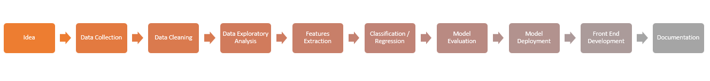
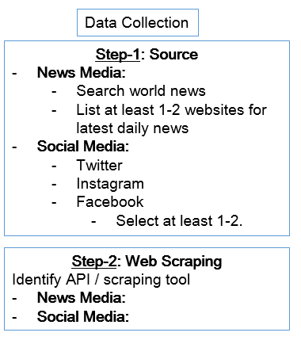

# INSPIRATION

The idea is to look for connections between a formal and an informal media posts. As the project is in the idea stage. The introduction will be populated once the project proceeds. 

# CODE
- Language : python, Flask
- ML Area  : NLP 

# PROPOSED STAGES
A rough draft of project pipiline is shared in the image below. Each stage is expected to be comeplted in 1-2 weeks of time and the document will be updated accordingly. 

## 1-IDEA
- Do we get affected by the world events? 
- Do we discuss international or national issues while socializing casually with our friends on social media?
- Do our sentiments get influenced by international / national affairs?

## 2-DATA COLLECTION
The follwoing areas will be considered for data collection purposes. 

## 3-DATA CLEANING

# RESOURCES
